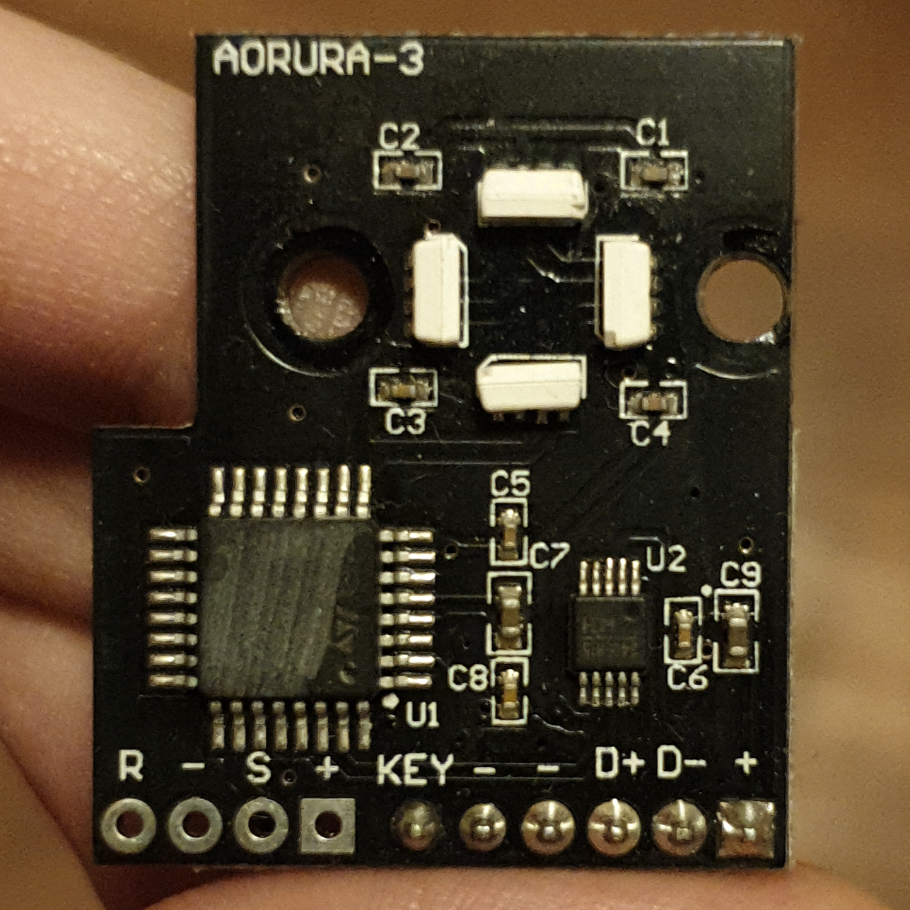
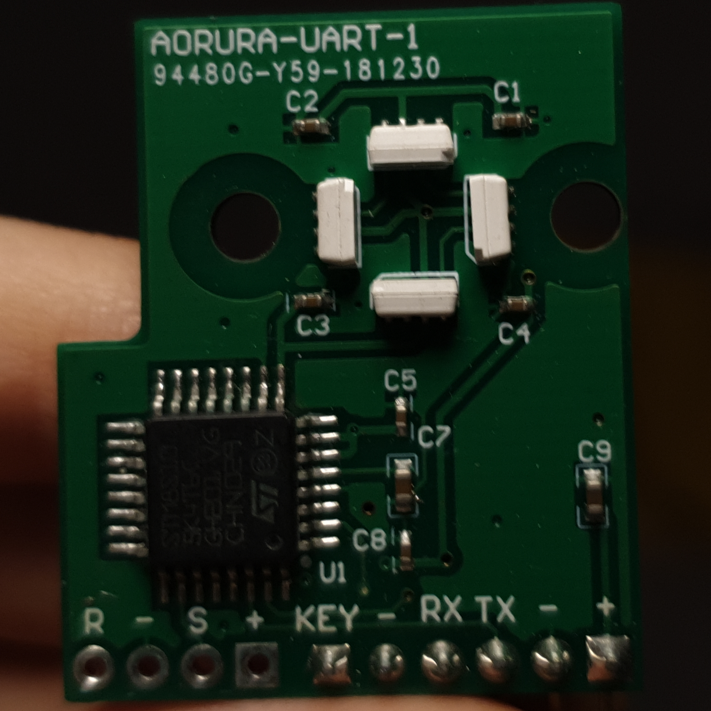

# AORURA

Library and CLI for managing AORURA LED state.

## Protocol

AORURA exposes serial 19200n8 connection. Every command is exactly two bytes:

- `XX` turns off LED
- `A<` enables signature aurora LED state
- color byte + `!` causes LED to light up with given color
- color byte + `*` causes LED to flash with given color at .5s interval

AORURA will respond with `Y` or `N` byte, depending on whether command was
successfully applied or not, respectively.

There is one more command, `SS`, which causes AORURA to respond with 2-byte
command representation of its current state. It's not currently implemented
as part of this project.

Valid color bytes:

- `B`: blue
- `G`: green
- `O`: orange
- `P`: purple
- `R`: red
- `Y`: yellow

## Library

[`aorura`](self) is a Rust crate for managing AORURA LED state. Usage example:

```rust
use aorura::*;
use failure::*;

fn main() -> Fallible<()> {
  let led = Led::open("/dev/ttyUSB0")?;

  led.set(State::Off)?; // turns off LED
  led.set(State::Flash(Color::Red))?; // cause LED to flash with red color

  assert_eq!(State::try_from(b"B*")?, State::Flash(Color::Blue));

  Ok(())
}
```

## CLI

[`aorura-cli`](cli) is a CLI tool built on top of [`aorura`](#library).

```
Usage: aorura-cli --path PATH --state STATE
       aorura-cli --help

Sets AORURA LED state.

Options:
  --path PATH        path to AORURA serial port
  --state STATE      desired LED state

States: aurora, flash:COLOR, off, static:COLOR
Colors: blue, green, orange, purple, red, yellow
```

## Compatibility

Fully compatible with:

- AORURA-3 (HoloPort and HoloPort+)

  

- AORURA-UART-1 (HoloPort Nano)

  
